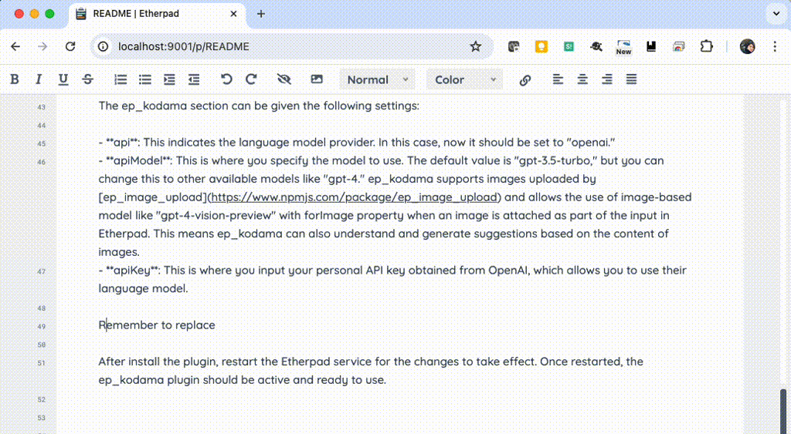

# ep_kodama

ep_kodama is a plugin that can be added to etherpad to provide writing assistance with LLM.



ep_kodama supports OpenAI as an LLM. Automatically guesses the continuation of a sentence and suggests candidate completions.
Once ep_kodama is activated and you type a sentence with Etherpad, it will automatically suggest a candidate to follow. If that suggestion is appropriate, you can use Shift+TAB to type it in.

ep_kodama provides the feature to all users of Etherpad, empowering collaborative document editing with real-time predictive typing.

# How to try

Use docker-compose to try ep_kodama.
First, set the `apiKey` in `demo/settings.json` to the API key obtained from OpenAI.
Then run the container as described below and access http://localhost:9001 .
Then click the [New Pad] button to create a new page.

```
docker-compose build
docker-compose up -d
```

# How to install

## Install the ep_kodama Plugin on Etherpad

To install ep_kodama, first, you need to install etherpad. Once Etherpad is installed, navigate to the root directory of etherpad and run the following command:

```
pnpm run plugins i ep_kodama
```

Also, If you want to target images uploaded using ep_image_upload for completion, run the following command to install sharp.

```
cd ./src # Change to the etherpad-lite/src directory
pnpm i "sharp@^0.33.4"
```

## Configure the OpenAI API settings in the settings.json file

After installing ep_kodama, you need to configure the OpenAI API settings. Open the `settings.json` file located in the root directory of your Etherpad installation. Inside this file, find the `"ep_kodama"` section and add your OpenAI API key like so:

```
  "ep_kodama": {
    "api": "openai",
    "apiModel": {
      "default": "gpt-4",
      "forImage": "gpt-4-vision-preview"
    },
    "apiKey": "your-api-key",
    "compaction": (Optional. See below for details.),
    "completion": (Optional. See below for details.)
  }
```

The ep_kodama section can be given the following settings:

- **api**: This indicates the language model provider. In this case, now it should be set to "openai."
- **apiModel**: This is where you specify the model to use. The default value is "gpt-3.5-turbo," but you can change this to other available models like "gpt-4." ep_kodama supports images uploaded by [ep_image_upload](https://www.npmjs.com/package/ep_image_upload) and allows the use of image-based model like "gpt-4-vision-preview" with forImage property when an image is attached as part of the input in Etherpad. This means ep_kodama can also understand and generate suggestions based on the content of images.
- **apiKey**: This is where you input your personal API key obtained from OpenAI, which allows you to use their language model.
- **compaction**: This is a setting that controls the level of compaction of the suggestions. Details are described below.
- **completion**: This is a setting that controls the level of completion of the suggestions. Details are described below.

Remember to replace `"your-api-key"` with your actual OpenAI API key. Save and close the file once you have added your key.

After install the plugin, restart the Etherpad service for the changes to take effect. Once restarted, the ep_kodama plugin should be active and ready to use.

### Using Gemini

ep_kodama also supports Google's Gemini API. To use it, set the `api` field to "gemini" and set the `apiKey` field to your API key.

```
  "ep_kodama": {
    "api": "gemini",
    "apiModel": "gemini-1.5-flash",
    "apiKey": "your-api-key",
    ...
  }
```

For Gemini, also replace `"your-api-key"` with your actual API key of Google AI Studio. You can obtain an API key from the following link:

https://aistudio.google.com/app/apikey

After restarting the Etherpad service, ep_kodama should be ready to use with the Gemini API.

### Compaction

To reduce the number of tokens sent to the LLM, ep_kodama can shorten text and reduce the size of images. This feature can be controlled using the `compaction` setting.

```
    "compaction": {
      "maxImageSize": {
        "width": 480,
        "height": 480
      },
      "maxContentLength": {
        "beforeLength": 20480,
        "afterLength": 1024
      }
    }
```

- **maxImageSize**: determines the maximum dimensions (width and height in pixels) to which images will be resized before being sent to the LLM.
- **maxContentLength**: controls the length of the content sent before and after the marker. 'beforeLength' dictates the maximum amount of data(in String.length) sent before the marker, whereas 'afterLength' defines the maximum length of the data following the marker. When the data exceeds these limits, it will be trimmed to fit accordingly.

### Completion

This setting controls when ep_kodama starts completion during text input.

```
    "completion": {
      "previousSeparator": ".$",
      "waitSeconds": 1
    }
```

- **previousSeparator**: This setting controls the separator that triggers the completion. ep_kodama will start suggesting completions when the text before the cursor ends with this separator.
- **waitSeconds**: This setting controls the time to wait before starting the completion. ep_kodama will start suggesting completions after this time has passed since the last keypress.
